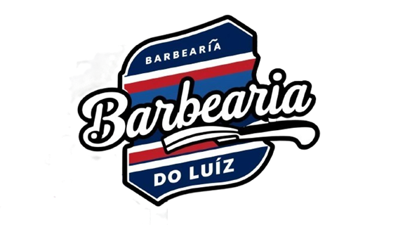

# Barbearia do Luiz



## 📋 Sobre o Projeto

A Barbearia do Luiz é um site institucional desenvolvido para uma barbearia fictícia, oferecendo uma experiência completa para os clientes. O site permite que os usuários conheçam os serviços oferecidos, visualizem produtos, entrem em contato e agendem horários de forma simples e intuitiva.

## ✨ Funcionalidades

- **Página Inicial**: Apresentação da barbearia, benefícios e depoimentos de clientes
- **Produtos e Serviços**: Catálogo com preços e descrições dos serviços oferecidos
- **Agendamento Online**: Sistema de agendamento com calendário interativo
- **Formulário de Contato**: Formulário com validação para facilitar a comunicação
- **Redes Sociais**: Integração com as principais redes sociais
- **Localização**: Mapa interativo mostrando a localização da barbearia
- **Design Responsivo**: Adaptado para diferentes tamanhos de tela

## 🛠️ Tecnologias Utilizadas

- HTML5
- CSS3
- JavaScript (Vanilla)
- Font Awesome (para ícones)
- Google Maps (para localização)

## 📱 Responsividade

O site é totalmente responsivo, adaptando-se a diferentes tamanhos de tela:
- Desktop
- Tablet
- Smartphone

## 🚀 Como Usar

1. Clone este repositório:
```
git clone https://github.com/seu-usuario/barbearia-do-luiz.git
```

2. Abra o arquivo `index.html` em seu navegador preferido.

3. Navegue pelo site para conhecer todas as funcionalidades.

## 📄 Estrutura do Projeto

```
barbearia-do-luiz/
│
├── index.html          # Página inicial
├── produtos.html       # Página de produtos e serviços
├── contato.html        # Página de contato
├── agenda.html         # Página de agendamento
├── style.css           # Estilos CSS
├── reset.css           # Reset CSS
├── script.js           # Scripts JavaScript
│
└── imagens/            # Pasta com imagens do site
    ├── Imagem2.png     # Logo da barbearia
    ├── banner.jpg      # Banner principal
    ├── cabelo.jpg      # Imagem do serviço de cabelo
    ├── barba.jpg       # Imagem do serviço de barba
    └── ...
```

## 📝 Formulários

O site possui dois formulários principais:

1. **Formulário de Contato**: Permite que os clientes entrem em contato com a barbearia.
2. **Formulário de Agendamento**: Permite que os clientes agendem horários para os serviços.

Ambos os formulários possuem validação em tempo real para garantir que os dados inseridos sejam válidos.

## 🎨 Design

O design do site segue uma paleta de cores moderna e elegante, com foco na experiência do usuário. Elementos interativos como botões, links e formulários possuem feedback visual para melhorar a usabilidade.

## 📱 Redes Sociais

O site integra links para as principais redes sociais:
- Facebook
- Instagram
- WhatsApp
- YouTube

## 📞 Contato

Para mais informações sobre este projeto, entre em contato através do formulário disponível no site.

---

Desenvolvido com ❤️ para a Barbearia do Luiz 